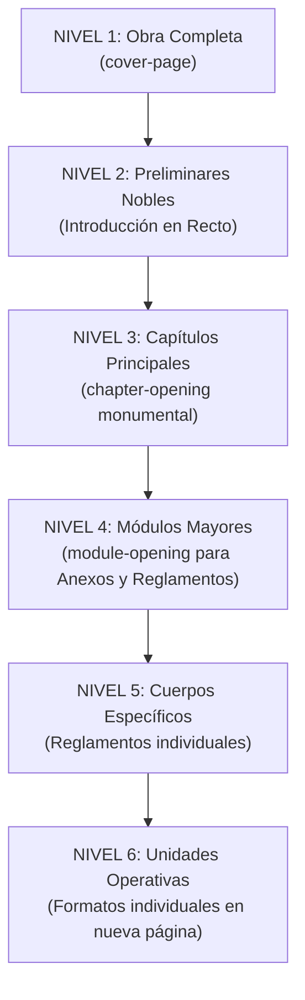

# ARQUITECTURA DE NAVEGACIÓN Y ANÁLISIS DE TABLA DE CONTENIDO (FASE 4.2)
**Protocolo Familiar POLIFLEX · Sistema Global de Consulta**  
**Estado:** Dictamen Arquitectónico / Sin Modificación de Código LOCKED

---

## 1. Taxonomía Integral de Aperturas (6 Niveles Jerárquicos)

Para gobernar el ritmo visual de la obra completa y evitar la inflación descontrolada de páginas blancas, se formaliza la siguiente taxonomía de 6 niveles:



| Nivel Jerárquico | Unidad Editorial | Tipo de Apertura | Presencia en RECTO | ¿Genera Verso Blanco? | Justificación Editorial |
| :--- | :--- | :--- | :---: | :---: | :--- |
| **NIVEL 1** | Obra Completa | `cover-page()` (Portada monumental) | SÍ (p. 1) | SÍ (p. 2 de guarda) | Portada exterior del libro maestro. |
| **NIVEL 2** | Introducción | `introduction-page()` (Apertura noble unitaria) | SÍ (p. 5) | SÍ (p. 6 de respeto) | Preámbulo ético; debe leerse antes de entrar a la densidad normativa. |
| **NIVEL 3** | Capítulos 01–09 | `chapter-opening()` (Pliego ceremonial con arco y matriz de puntos) | SÍ (página impar) | SÍ (página par previa de portadilla) | Máxima solemnidad doctrinal del Protocolo Familiar. |
| **NIVEL 4** | Macro-Módulos (Anexos / Reglamentos) | `module-opening()` (Portadilla de sección sobria sin arco) | SÍ (página impar) | SÍ (página par de transición) | Separa físicamente los tres grandes bloques del volumen encuadernado. |
| **NIVEL 5** | Reglamentos Individuales (Asamblea, Consejo, Comité) | `regulation-header()` (Encabezado noble superior en nueva página) | SÍ (recomendado) | NO (el texto inicia en la misma página) | Permite autonomía orgánica sin inflar páginas vacías innecesarias. |
| **NIVEL 6** | Formatos Operativos (7 unidades) | `legal-form-container()` (Inicio forzado en página nueva) | Indiferente (Recto o Verso) | NO | Asegura que cada formato sea autocontenido e imprimible por separado. |

---

## 2. Sistema de Navegación en Cabeceras y Folios

El lector del Protocolo debe poder abrir el libro en cualquier página y saber instantáneamente en qué sección se encuentra:

### A. Running Headers (Cabeceras Superiores)
- **Páginas Verso (Pares, Izquierda):**
  - Texto fijo: `Poliductos Flexibles, S.A. de C.V. · Protocolo Familiar`
  - Tipografía: Neuzeit Grotesk, 5 pt, tracking 0.200 em, color #6c6b67.
- **Páginas Recto (Impares, Derecha):**
  - **En Capítulos 01–09:** `CAPÍTULO 0X: [TÍTULO CORTO]`
  - **En Reglamentos:** `REGLAMENTO: [ASAMBLEA / CONSEJO / COMITÉ]`
  - **En Anexos:** `ANEXO: FORMATO OPERATIVO [N]`
- **Regla de Supresión:** Las cabeceras se suprimen totalmente en:
  1. Portadas y portadillas (`cover-page`, `chapter-opening`, `module-opening`).
  2. Página de Tabla de Contenido.
  3. Primera página de la Introducción.
  4. Páginas blancas ceremoniales de transición.

### B. Sistema de Foliación
- **Foliado Maestro Continuo:** Toda la obra comparte una única secuencia arábiga ascendente (1, 2, 3... N).
- **Posición del Folio:** En el margen exterior inferior (`dx: 22.70 pt` en verso, `dx: 373.30 pt` en recto), línea de base a `594.6387 pt`.

---

## 3. Análisis Forense Crítico de la Tabla de Contenido (`table-of-contents()`)

### A. Estado Actual del Componente
El componente `table-of-contents(cfg, chapters: none)` en `templates/typst/componentes.typ` está formalmente calificado como **`APPROVED / LOCKED`**.

### B. Diagnóstico de Capacidad Física y Geométrica
Al inspeccionar `componentes.typ` y `config/editorial_config.yaml`, se constata la siguiente realidad arquitectónica:
1. **Diseño Unipaginar Rígido:** La tabla de contenido está programada para una **sola página fija en Recto (Media Carta, 396 × 612 pt)**, reproduciendo al milímetro el diseño vectorial de Adobe Illustrator.
2. **Matriz de Puntos Decorativa:** Posee una matriz lateral de puntos de 7 columnas × 38 filas (266 puntos) que ocupa desde `y = 117.97 pt` hasta `y = 441.86 pt`.
3. **Líneas de Base Fijas (Baselines Hardcoded):** Cada uno de los 9 capítulos del Protocolo tiene una coordenada vertical absoluta prefijada:
   - Cap 01: `89.04 pt`
   - Cap 02: `126.58 pt`
   - Cap 03: `164.21 pt`
   - Cap 04: `213.23 pt`
   - Cap 05: `238.59 pt`
   - Cap 06: `275.54 pt`
   - Cap 07: `312.78 pt`
   - Cap 08: `350.20 pt`
   - Cap 09: `386.67 pt`
4. **Espacio Remanente al Fondo:** El último capítulo termina en `y = 386.67 pt` (más 2 líneas de título = `~415 pt`). El pie de página institucional se sitúa en `y = 594.64 pt`. El espacio libre total vertical es de aproximadamente **150 pt**.

### C. Impacto de Incorporar los Módulos Complementarios
Para integrar la obra completa se requeriría listar:
- `Introducción` (1 entrada previa a Cap 01).
- `Capítulos 01–09` (9 entradas existentes).
- `Anexos y Formatos Operativos` (1 entrada general o 7 formatos específicos).
- `Reglamentos de Gobierno Familiar` (1 entrada general o 3 reglamentos específicos).
- **Total de Entradas Nuevas:** Entre 3 y 11 entradas adicionales (total: 12 a 20 líneas).

### D. Imposibilidad Física en el Diseño Actual
- Es **matemáticamente y visualmente imposible** acomodar 14 a 20 entradas en la página única actual respetando la retícula de Illustrator, las coordenadas fijas y la matriz de 38 filas de puntos sin provocar colisiones catastróficas sobre el pie de página o encimar los textos.

---

## 4. Dictamen Oficial sobre Desbloqueo de TOC

```
TOC REQUIERE DESBLOQUEO = TRUE
```

### Fundamentación Técnica del Desbloqueo Futuro
El componente `table-of-contents()` actual fue diseñado exclusivamente como prototipo de visualización para los Capítulos 01–09. Para que el Protocolo Familiar funcione como una **SOLA OBRA INTEGRADA**, el componente TOC **deberá ser formalmente desbloqueado en la Fase 4.3 o fase subsiguiente autorizada por el usuario**, a fin de:

1. **Permitir Layout de 2 Páginas (Díptico de Contenido en Verso–Recto):**
   - Página Izquierda (Verso): `INTRODUCCIÓN` + `CAPÍTULOS 01 A 09`.
   - Página Derecha (Recto): `ANEXOS Y FORMATOS OPERATIVOS` + `REGLAMENTOS DE GOBIERNO FAMILIAR`.
   - O bien:
2. **TOC Sintética / Estructurada Unipaginar:**
   - Rediseñar la distribución vertical para agrupar en 4 grandes bloques maestros:
     1. `PREÁMBULO: Introducción Institucional`
     2. `PROTOCOLO FAMILIAR: Capítulos 01 al 09`
     3. `ANEXOS: Formatos Operativos e Instrumentos de Captura`
     4. `REGLAMENTOS: Órganos de Gobierno Familiar`

### Garantía de Integridad en Fase 4.2
En estricto cumplimiento de las restricciones de la Fase 4.2:
- **NO se modifica `table-of-contents()` ni su configuración YAML.**
- **El componente permanece formalmente en su estado LOCKED.**
- Se emite este dictamen para que el usuario tome la decisión informada sobre cuándo y cómo autorizar su apertura en la siguiente fase de diseño.
