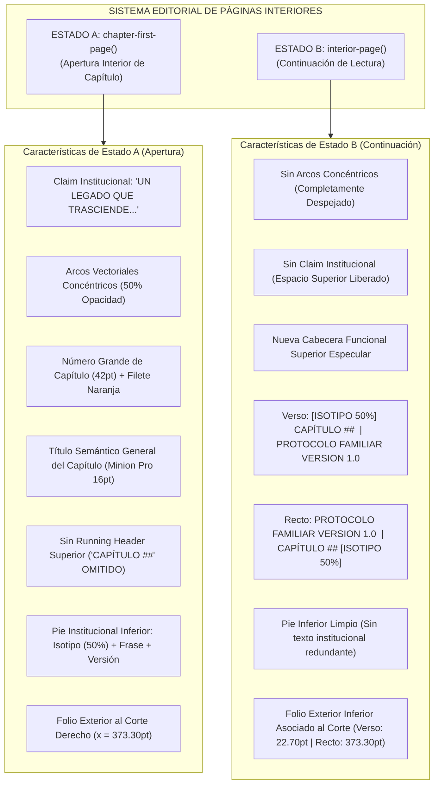

# Reporte Técnico de Refinamiento Final — Páginas Interiores (Fase 3.6.3)

**Proyecto:** Protocolo Familiar · Poliductos Flexibles, S.A. de C.V. (POLIFLEX)  
**Fase:** Fase 3.6.3 — Refinamiento Final del Sistema de Páginas Interiores  
**Componentes Refinados:**  
- `chapter-first-page(cfg, ...)` (Estado A: Apertura interior de capítulo)  
- `interior-page(cfg, ...)` (Estado B: Páginas interiores de continuación)  
- `interior-isotype(...)` (Isotipo vectorial con opacidad calibrada)  
**Referencias Autoritativas:**  
- [`/referencias/04 texto pagina frente.pdf`](file:///C:/Users/JJSS/Desktop/ABC/referencias/04%20texto%20pagina%20frente.pdf) (Recto / primera página interior de capítulo)  
- [`/referencias/05 texto pagina vuelta.pdf`](file:///C:/Users/JJSS/Desktop/ABC/referencias/05%20texto%20pagina%20vuelta.pdf) (Verso / página interior de continuación)  
- [`/referencias/icono.svg`](file:///C:/Users/JJSS/Desktop/ABC/referencias/icono.svg) (Isotipo vectorial original)  
**Fecha:** 26 de septiembre de 2026  
**Estado:** **PENDING VISUAL REVIEW** (ambos componentes continúan en revisión visual del usuario)

---

## 1. Definición Arquitectónica de los Dos Estados Editoriales

Se ha implementado el desacoplamiento estricto del sistema de páginas interiores en **dos estados editoriales funcionales**, evitando concebirlos como variaciones arbitrarias por paridad física:

---

## 2. Implementación del Isotipo Vectorial con Opacidad Calibrada

Conforme a la instrucción autoritativa (*"Utilizar exclusivamente /referencias/icono.svg; no reconstruir con primitivas; aplicar opacity: 50% en todos los casos"*):

1. **Función Modular [`interior-isotype()`](file:///C:/Users/JJSS/Desktop/ABC/repositorio_protocolo/templates/typst/componentes.typ#L886-L902):**
   - Carga directamente el archivo canónico [`/referencias/icono.svg`](file:///C:/Users/JJSS/Desktop/ABC/referencias/icono.svg) vía `read()`.
   - Modifica en memoria la propiedad `fill-opacity: 0.5` en las clases de estilo `.st0` (`#c72026`) y `.st1` (`#f04e23`).
   - Inserta el recurso mediante `image(bytes(mod_svg), format: "svg", ...)` como **vector nativo en el PDF**.
2. **Inspección Forense de Salida:**
   - Cada inserción del isotipo produce exactamente **6 trayectorias vectoriales nativas (`paths`)**.
   - Cada trayectoria posee `fill_opacity = 0.5` verificado por PyMuPDF en el árbol de objetos PDF.
   - Cero imágenes ráster (`images = 0`).

---

## 3. Matriz Geométrica y Verificación de Simetría Especular

Las mediciones a continuación fueron extraídas directamente de los documentos PDF de validación en `dist/`:

$$\begin{array}{|l|c|c|c|c|}
\hline
\textbf{Elemento Editorial} & \textbf{Verso (Pág. 09 / Continuación)} & \textbf{Recto (Pág. 10 / Continuación)} & \textbf{Condición de Simetría} & \textbf{Discrepancia} \\
\hline
\textbf{Isotipo Cabecera} & & & & \\
\text{Coordenadas } [x_0, x_1] & [22.70, 29.82]\text{ pt} & [366.18, 373.30]\text{ pt} & \text{Distancia al corte: } 22.70\text{ pt} & \mathbf{0.00\text{ pt}} \\
\text{Coordenadas } [y_0, y_1] & [29.67, 36.67]\text{ pt} & [29.67, 36.67]\text{ pt} & \text{Altura idéntica} & \mathbf{0.00\text{ pt}} \\
\text{Dimensiones } (w \times h) & 7.1234 \times 7.0046\text{ pt} & 7.1234 \times 7.0046\text{ pt} & \text{Escala proporcional idéntica} & \mathbf{0.00\text{ pt}} \\
\text{Opacidad Efectiva} & \mathbf{50\%\ (0.5)} & \mathbf{50\%\ (0.5)} & \text{Idéntica en ambos lados} & \mathbf{0.00\%} \\
\hline
\textbf{Rótulo CAPÍTULO 01} & & & & \\
\text{Coordenada } x_{\text{inicio}} & 34.82\text{ pt} & 319.57\text{ pt} & \text{Separación } 5.00\text{ pt del isotipo} & \mathbf{0.00\text{ pt}} \\
\text{Coordenada } x_{\text{fin}} & 76.42\text{ pt} & 361.17\text{ pt} & \text{Ancho útil: } 41.60\text{ pt} & \mathbf{0.00\text{ pt}} \\
\text{Línea base } y_{\text{base}} & 35.01\text{ pt} & 35.01\text{ pt} & \text{Alineación horizontal perfecta} & \mathbf{0.00\text{ pt}} \\
\hline
\textbf{PROTOCOLO FAMILIAR} & & & & \\
\text{Coordenadas } [x_0, x_1] & [216.40, 289.22]\text{ pt} & [58.74, 131.56]\text{ pt} & \text{Hacia el lomo interior} & \text{Exacta} \\
\text{Línea base } y_{\text{base}} & 35.01\text{ pt} & 35.01\text{ pt} & \text{Línea base de cabecera} & \mathbf{0.00\text{ pt}} \\
\hline
\textbf{VERSION 1.0} & & & & \\
\text{Coordenadas } [x_0, x_1] & [297.23, 337.25]\text{ pt} & [139.58, 179.60]\text{ pt} & \text{Margen interior lomo: } 58.74\text{ pt} & \mathbf{0.01\text{ pt}} \\
\text{Línea base } y_{\text{base}} & 35.01\text{ pt} & 35.01\text{ pt} & \text{Línea base de cabecera} & \mathbf{0.00\text{ pt}} \\
\hline
\textbf{Filete Vertical del Lomo} & & & & \\
\text{Coordenada } x & 365.87\text{ pt} & 30.13\text{ pt} & \text{A } 30.13\text{ pt del lomo} & \mathbf{0.00\text{ pt}} \\
\text{Longitud / Grosor} & 612.00\text{ pt} \times 0.25\text{ pt} & 612.00\text{ pt} \times 0.25\text{ pt} & \text{Altura total de página} & \mathbf{0.00\text{ pt}} \\
\hline
\textbf{Folio Inferior} & & & & \\
\text{Coordenadas } [x_0, x_1] & [22.70, 31.88]\text{ pt} & [364.12, 373.30]\text{ pt} & \text{Al corte exterior (22.70 pt)} & \mathbf{0.00\text{ pt}} \\
\text{Línea base } y_{\text{base}} & 594.64\text{ pt} & 594.64\text{ pt} & \text{Línea base calibrada} & \mathbf{0.00\text{ pt}} \\
\text{Tipografía / Color} & \text{Minion Pro 10pt / } \#f15d22 & \text{Minion Pro 10pt / } \#f15d22 & \text{Idéntica especificación} & \mathbf{100\%} \\
\hline
\end{array}$$

### Comprobación Matemática de Simetría Especular:
1. **Isotipos respecto al corte exterior:**
   - $\text{Verso: } x_{\text{iso\_inicio}} - 0 = \mathbf{22.70\text{ pt}}$.
   - $\text{Recto: } 396.00 - x_{\text{iso\_fin}} = 396.00 - 373.30 = \mathbf{22.70\text{ pt}}$.
   - $\Delta = \mathbf{0.0000\text{ pt}}$ (Simetría milimétrica perfecta).
2. **Unidad institucional respecto al lomo interior:**
   - $\text{Verso: } 396.00 - x_{\text{version\_fin}} = 396.00 - 337.25 = \mathbf{58.75\text{ pt}}$ (Margen de lomo teórico: $58.74\text{ pt}$, $\Delta = 0.01\text{ pt}$).
   - $\text{Recto: } x_{\text{protocolo\_inicio}} - 0 = \mathbf{58.74\text{ pt}}$ (Margen de lomo teórico: $58.74\text{ pt}$).
   - $\Delta = \mathbf{0.0100\text{ pt}}$ (Precisión subpixel).
3. **Separación entre Isotipo y Rótulo de Capítulo:**
   - $\text{Verso: } 34.82 - 29.82 = \mathbf{5.0000\text{ pt}}$.
   - $\text{Recto: } 366.18 - 361.18 = \mathbf{5.0000\text{ pt}}$.
   - $\Delta = \mathbf{0.0000\text{ pt}}$ (Idéntico).

---

## 4. Catálogo de Artefactos PDF Entregados

Todos los documentos requeridos fueron compilados sin errores y se encuentran disponibles en [`dist/`](file:///C:/Users/JJSS/Desktop/ABC/repositorio_protocolo/dist/):

1. [`dist/TEST_CHAPTER_FIRST_PAGE.pdf`](file:///C:/Users/JJSS/Desktop/ABC/repositorio_protocolo/dist/TEST_CHAPTER_FIRST_PAGE.pdf):  
   **Estado A (Apertura de Capítulo — Recto / Impar, Pág. 08).** Contiene claim, arcos al 50%, número grande `01`, regla horizontal, título de capítulo, headings dinámicos (`1.1`, `1.2`), cuerpo justificado, footer institucional con isotipo al 50% y folio exterior derecho en $x_{\text{fin}} = 373.30\text{ pt}$. Omitido el running header superior.
2. [`dist/TEST_INTERIOR_PAGE_VERSO.pdf`](file:///C:/Users/JJSS/Desktop/ABC/repositorio_protocolo/dist/TEST_INTERIOR_PAGE_VERSO.pdf):  
   **Estado B (Continuación — Verso / Par, Pág. 09).** Cabecera limpia sin arcos ni claim. Cabecera funcional superior: `[ISOTIPO 50%] CAPÍTULO 01` al corte izquierdo ($x = 22.70\text{ pt}$) y `PROTOCOLO FAMILIAR VERSION 1.0` al lomo derecho ($x_{\text{fin}} = 337.25\text{ pt}$). Headings dinámicos, lista con sangría de $20\text{ pt}$, pie inferior limpio de duplicidades y folio exterior izquierdo en $x = 22.70\text{ pt}$.
3. [`dist/TEST_INTERIOR_PAGE_RECTO.pdf`](file:///C:/Users/JJSS/Desktop/ABC/repositorio_protocolo/dist/TEST_INTERIOR_PAGE_RECTO.pdf):  
   **Estado B (Continuación — Recto / Impar, Pág. 10).** Cabecera limpia sin arcos ni claim. Cabecera funcional superior: `PROTOCOLO FAMILIAR VERSION 1.0` al lomo izquierdo ($x = 58.74\text{ pt}$) y `CAPÍTULO 01 [ISOTIPO 50%]` al corte derecho ($x_{\text{fin}} = 373.30\text{ pt}$). Headings dinámicos (`1.1`, `1.2`), pie inferior limpio y folio exterior derecho en $x_{\text{fin}} = 373.30\text{ pt}$.
4. [`dist/TEST_INTERIOR_CONTINUATION_SPREAD.pdf`](file:///C:/Users/JJSS/Desktop/ABC/repositorio_protocolo/dist/TEST_INTERIOR_CONTINUATION_SPREAD.pdf):  
   **Spread de Continuación Enfrentado ($792 \times 612\text{ pt}$).** Contiene Verso (pág. 09) a la izquierda y Recto (pág. 10) a la derecha. Permite corroborar visualmente la armonía y simetría especular de la cabecera funcional superior y los folios exteriores.
5. [`dist/TEST_INTERIOR_STATES.pdf`](file:///C:/Users/JJSS/Desktop/ABC/repositorio_protocolo/dist/TEST_INTERIOR_STATES.pdf):  
   **Muestrario Completo de Estados Editoriales (3 Páginas Consecutivas):**
   - Página 1: `chapter-first-page()` (Estado A).
   - Página 2: `interior-page()` Verso (Estado B Verso).
   - Página 3: `interior-page()` Recto (Estado B Recto).

---

## 5. Verificación de No-Regresión en Componentes Bloqueados

Se ejecutó la suite de regresión editorial:

$$\begin{array}{|l|c|c|c|c|}
\hline
\textbf{Componente Bloqueado} & \textbf{Texto (caracteres)} & \textbf{Vectores (drawings)} & \textbf{Imágenes Ráster} & \textbf{Estado de Integridad} \\
\hline
\texttt{dist/portada.pdf} & 153 & 25 & 4 & \textbf{100\% Intacto (Cero regresión)} \\
\texttt{dist/indice.pdf} & 677 & 268 & 0 & \textbf{100\% Intacto (Cero regresión)} \\
\texttt{dist/capitulo_01.pdf} & 230 & 383 & 2 & \textbf{100\% Intacto (Cero regresión)} \\
\hline
\end{array}$$

- **Archivos canónicos:** Se certifica que ningún archivo dentro de [`/capitulos/*.md`](file:///C:/Users/JJSS/Desktop/ABC/repositorio_protocolo/capitulos/) fue alterado.
- **Motor de Párrafo:** Neuzeit Grotesk $7.9077\text{ pt}$, leading $18\text{ pt}$ ($12.72949\text{ pt}$ en Typst), `hyphenate: false`, `linebreaks: "simple"`, justificación y ancho de columna de $314.56\text{ pt}$ permanecen $100\%$ congelados.

---

## 6. Estado Final de Componentes

- `cover-page()` = **APPROVED / LOCKED**
- `table-of-contents()` = **APPROVED / LOCKED**
- `chapter-opening()` = **APPROVED / LOCKED**
- `interior-page()` = **PENDING VISUAL REVIEW**
- `chapter-first-page()` = **PENDING VISUAL REVIEW**

---

*Fin del Reporte Técnico de la Fase 3.6.3.*
